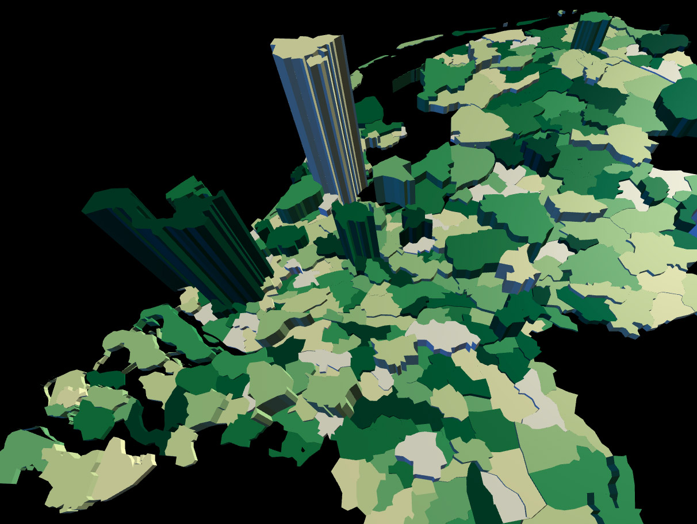
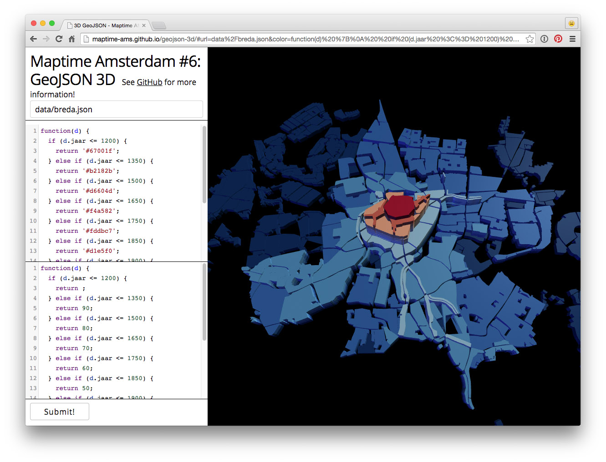
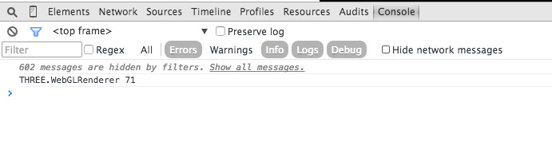

# Maptime Amsterdam #6: GeoJSON 3D!

http://maptime-ams.github.io/geojson-3d/

Display GeoJSON in 3D in the browser, using [Three.js](http://threejs.org/). Made for [Maptime Amsterdam #6](http://www.meetup.com/Maptime-AMS/events/220184217/).

Use `git clone https://github.com/maptime-ams/geojson-3d.git` to clone this tutorial, run a webserver in the project's directory (`python -m SimpleHTTPServer`, for example), and open [http://localhost:8000](http://localhost:8000). Edit [`index.html`](index.html) to tweak the lights, materials and camera used in this tutorial. Some basic Three.js materials are included in the source code. You can set a Feature's material in the `addFeature` function.



## Usage

With http://maptime-ams.github.io/geojson-3d/, you can load a GeoJSON or TopoJSON file from a URL, and style the features using Javascript functions (just like D3).

Simple function, always return the same color:

```js
function(d) {
  return '#0ef1f4';
}
```

Simple function, always return the same color:

```js
function(d) {
  if (d.jaar <= 1200) {
    return '#67001f';
  } else if (d.jaar <= 1350) {
    return '#b2182b';
  } else if (d.jaar <= 1500) {
    return '#d6604d';
  } else if (d.jaar <= 1650) {
    return '#f4a582';
  } else if (d.jaar <= 1750) {
    return '#fddbc7';
  } else if (d.jaar <= 1850) {
    return '#d1e5f0';
  } else if (d.jaar <= 1900) {
    return '#92c5de';
  } else if (d.jaar <= 1950) {
    return '#4393c3';
  } else if (d.jaar <= 1980) {
    return '#2166ac';
  } else if (d.jaar <= 2010) {
    return '#053061';
  }
}
```

```js
function(d) {
  var color = d3.scale.ordinal()
    .range([
      "#ffffe5",
      "#f7fcb9",
      "#d9f0a3",
      "#addd8e",
      "#78c679",
      "#41ab5d",
      "#238443",
      "#006837",
      "#004529"
    ])
    .domain(d3.range(0, 8000));
  return color(d.BEV_DICHTH);
}
```

If you don't remember your Feature's properties, you can use `console.log(d)` to output them to the developer console:

```js
function(d) {
  console.log(d);
  return 'red';
}
```

## Examples

- [Dutch municipalities](http://maptime-ams.github.io/geojson-3d/#url=data%2Fmunicipalities.json&color=function(d)%20%7B%0A%20%20var%20color%20%3D%20d3.scale.ordinal()%0A%20%20%20%20.range(%5B%0A%20%20%20%20%20%20%22%23ffffe5%22%2C%0A%20%20%20%20%20%20%22%23f7fcb9%22%2C%0A%20%20%20%20%20%20%22%23d9f0a3%22%2C%0A%20%20%20%20%20%20%22%23addd8e%22%2C%0A%20%20%20%20%20%20%22%2378c679%22%2C%0A%20%20%20%20%20%20%22%2341ab5d%22%2C%0A%20%20%20%20%20%20%22%23238443%22%2C%0A%20%20%20%20%20%20%22%23006837%22%2C%0A%20%20%20%20%20%20%22%23004529%22%0A%20%20%20%20%5D)%0A%20%20%20%20.domain(d3.range(0%2C%208000))%3B%0A%20%20return%20color(d.BEV_DICHTH)%3B%0A%7D&height=function(d)%20%7B%0A%20%20return%20d.AANT_INW%20%2F%205000%3B%0A%7D) (uses [`municipalities.json`](data/municipalities.json))
- [Buildings in Amsterdam with complex geometries (many points)](http://maptime-ams.github.io/geojson-3d/#url=data%2Fbuildings.json&color=function(d)%20%7B%0A%20%20return%20'%230ef1f4'%3B%0A%7D&height=function(d)%20%7B%0A%20%20return%2010%3B%0A%7D) (uses [`buildings.json`](data/buildings.json), also used on [maptime-ams.github.io](http://maptime-ams.github.io))
- [Growth of the city of Breda](http://maptime-ams.github.io/geojson-3d/#url=data%2Fbreda.json&color=function(d)%20%7B%0A%20%20if%20(d.jaar%20%3C%3D%201200)%20%7B%0A%20%20%20%20return%20'%2367001f'%3B%0A%20%20%7D%20else%20if%20(d.jaar%20%3C%3D%201350)%20%7B%0A%20%20%20%20return%20'%23b2182b'%3B%0A%20%20%7D%20else%20if%20(d.jaar%20%3C%3D%201500)%20%7B%0A%20%20%20%20return%20'%23d6604d'%3B%0A%20%20%7D%20else%20if%20(d.jaar%20%3C%3D%201650)%20%7B%0A%20%20%20%20return%20'%23f4a582'%3B%0A%20%20%7D%20else%20if%20(d.jaar%20%3C%3D%201750)%20%7B%0A%20%20%20%20return%20'%23fddbc7'%3B%0A%20%20%7D%20else%20if%20(d.jaar%20%3C%3D%201850)%20%7B%0A%20%20%20%20return%20'%23d1e5f0'%3B%0A%20%20%7D%20else%20if%20(d.jaar%20%3C%3D%201900)%20%7B%0A%20%20%20%20return%20'%2392c5de'%3B%0A%20%20%7D%20else%20if%20(d.jaar%20%3C%3D%201950)%20%7B%0A%20%20%20%20return%20'%234393c3'%3B%0A%20%20%7D%20else%20if%20(d.jaar%20%3C%3D%201980)%20%7B%0A%20%20%20%20return%20'%232166ac'%3B%0A%20%20%7D%20else%20if%20(d.jaar%20%3C%3D%202010)%20%7B%0A%20%20%20%20return%20'%23053061'%3B%0A%20%20%7D%0A%7D&height=function(d)%20%7B%0A%20%20if%20(d.jaar%20%3C%3D%201200)%20%7B%0A%20%20%20%20return%20%3B%0A%20%20%7D%20else%20if%20(d.jaar%20%3C%3D%201350)%20%7B%0A%20%20%20%20return%2090%3B%0A%20%20%7D%20else%20if%20(d.jaar%20%3C%3D%201500)%20%7B%0A%20%20%20%20return%2080%3B%0A%20%20%7D%20else%20if%20(d.jaar%20%3C%3D%201650)%20%7B%0A%20%20%20%20return%2070%3B%0A%20%20%7D%20else%20if%20(d.jaar%20%3C%3D%201750)%20%7B%0A%20%20%20%20return%2060%3B%0A%20%20%7D%20else%20if%20(d.jaar%20%3C%3D%201850)%20%7B%0A%20%20%20%20return%2050%3B%0A%20%20%7D%20else%20if%20(d.jaar%20%3C%3D%201900)%20%7B%0A%20%20%20%20return%2040%3B%0A%20%20%7D%20else%20if%20(d.jaar%20%3C%3D%201950)%20%7B%0A%20%20%20%20return%2030%3B%0A%20%20%7D%20else%20if%20(d.jaar%20%3C%3D%201980)%20%7B%0A%20%20%20%20return%2020%3B%0A%20%20%7D%20else%20if%20(d.jaar%20%3C%3D%202010)%20%7B%0A%20%20%20%20return%2010%3B%0A%20%20%7D%0A%7D) (uses [`breda.json`](data/breda.json), from [Histograph](http://histograph.io/viewer/#search=breda type=hg:Place))



## Disable Three.js warnings

You can disable warnings in your browsers' developer console:



## Useful links

- http://tulpinteractive.com/amsterdam-campus/
- http://www.smartjava.org/content/render-geographic-information-3d-threejs-and-d3js
- http://threejs.org/examples/webgl_geometry_shapes.html
- http://threejs.org/examples/webgl_geometry_extrude_shapes2.html

## Data

- [Centraal Bureau voor de Statistiek](http://www.cbs.nl/nl-NL/menu/themas/dossiers/nederland-regionaal/publicaties/geografische-data/archief/2015/wijk-en-buurtkaart-2014-art.htm)
- [Natural Earth](http://www.naturalearthdata.com/)
- OpenStreetMap, using [Overpass Turbo](http://overpass-turbo.eu/) (and choosing _Save as GeoJSON..._)

Example Overpass query:

    [out:json];
    way[natural=water](around:5000,52.36740138260664,4.8985666036605835);
    (._;>;);
    out;

## Colors!

Use http://colorbrewer2.org/!

## TopoJSON

You can convert large GeoJSON files to [TopoJSON](https://github.com/mbostock/topojson), this will make them much smaller and easier to handle for web browsers. (And you can convert Shapefiles to GeoJSON with [shp2json](https://github.com/substack/shp2json).)

Usage:
```
topojson -p -s 1e-8 -o municipalities.topojson municipalities.geojson
```
